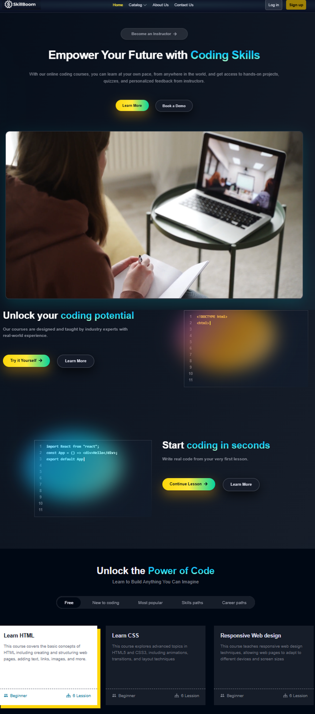
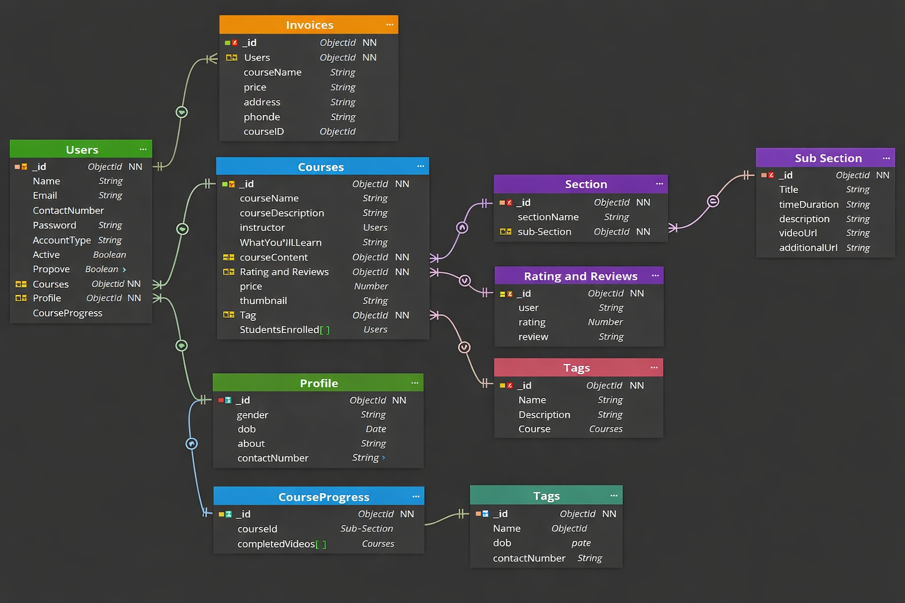
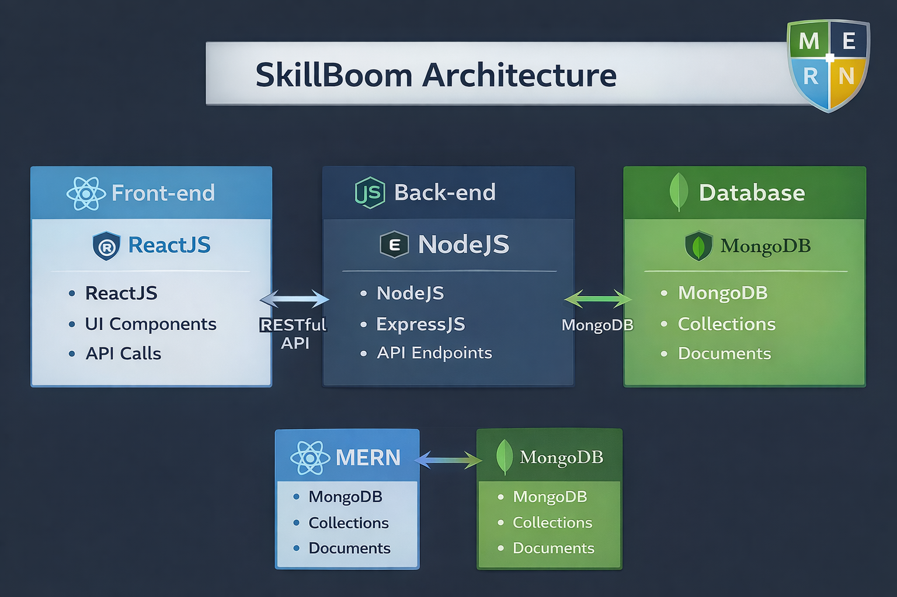

==================================================
SkillBoom – EdTech Platform
==================================================



SkillBoom is a fully functional EdTech platform that allows users to create, consume, and rate educational content.  
The platform is built using the **MERN Stack**, which includes **ReactJS, NodeJS, MongoDB, and ExpressJS**.

---

## Table of Contents

- [Introduction](#introduction)
- [System Architecture](#system-architecture)
  - [Front-end](#front-end)
  - [Back-end](#back-end)
  - [Database](#database)
  - [Architecture Diagram](#architecture-diagram)
- [API Design](#api-design)
- [Installation](#installation)
- [Configuration](#configuration)
- [Usage](#usage)

---

==================================================
## Introduction
==================================================

SkillBoom aims to provide students with a **seamless and interactive learning experience**, making education more **accessible and engaging**.

The platform also empowers **instructors** to showcase their expertise and connect with learners from around the world.

In the following sections, we cover:
- System Architecture
- API Design
- Installation steps
- Usage instructions

---

==================================================
## System Architecture
==================================================

The SkillBoom platform is composed of **three main components**:
1. Front-end  
2. Back-end  
3. Database  

It follows a **client-server architecture**, where:
- **Front-end** acts as the client
- **Back-end and Database** act as the server

---

==================================================
## Front-end
==================================================

The front-end is developed using **ReactJS**, enabling the creation of **dynamic and responsive user interfaces**.

The front-end communicates with the back-end through **RESTful API calls**.

---

### Front-end Pages

#### For Students:
- **Homepage:** Platform introduction with links to courses and user details
- **Course List:** Displays all available courses with descriptions and ratings
- **Wishlist:** Shows courses added by the student
- **Cart Checkout:** Handles course purchase flow
- **Course Content:** Displays videos and learning materials
- **User Details:** Shows student profile information
- **Edit Profile:** Allows users to update their account details

#### For Instructors:
- **Dashboard:** Overview of created courses with ratings and feedback
- **Insights:** Analytics such as views and engagement metrics
- **Course Management:** Create, update, and delete courses
- **Profile Management:** View and edit instructor profile details

---

### Front-end Tools and Libraries

- ReactJS
- CSS
- Tailwind CSS
- Redux (State Management)

---

==================================================
## Back-end
==================================================

The back-end is built using **NodeJS and ExpressJS** and provides APIs consumed by the front-end.

It is responsible for:
- Authentication and authorization
- Course creation and consumption
- Business logic handling
- Data processing and storage

---

### Back-end Features

- **User Authentication & Authorization** using JWT
- **OTP verification** and **Forgot Password** functionality
- **Course Management (CRUD operations)**
- **Razorpay Payment Integration**
- **Cloudinary** for cloud-based media storage
- **Markdown-based course content**

---

### Back-end Frameworks and Tools

- Node.js
- Express.js
- MongoDB
- JWT (JSON Web Tokens)
- Bcrypt (Password hashing)
- Mongoose (ODM)

---

### Data Models

- **Student Schema**
  - Name, email, password, enrolled courses

- **Instructor Schema**
  - Name, email, password, created courses

- **Course Schema**
  - Course name, description, instructor
  - Media content and pricing

---

==================================================
## Database
==================================================



The database is built using **MongoDB (NoSQL)**, which efficiently stores **unstructured and semi-structured data**.

### Stored Data:
- Users
- Courses
- Enrollments
- Payments

---

==================================================
## Architecture Diagram
==================================================



The diagram above shows the **high-level architecture** of the SkillBoom platform.

---

==================================================
## API Design
==================================================

SkillBoom follows a **RESTful API architecture**.

- Built using **Node.js and Express.js**
- Uses **JSON** for data exchange
- Supports standard HTTP methods:
  - GET
  - POST
  - PUT
  - DELETE

---

==================================================
## Installation
==================================================

1. Clone the repository:
   ```bash
   git clone https://github.com/username/repo.git
2. Navigate to the project directory: cd SkillBoom
3.Install dependencies: npm install
